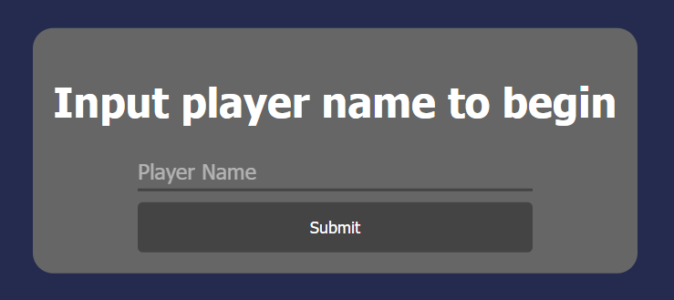
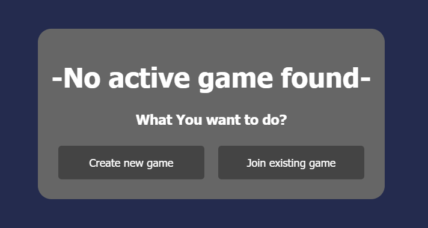
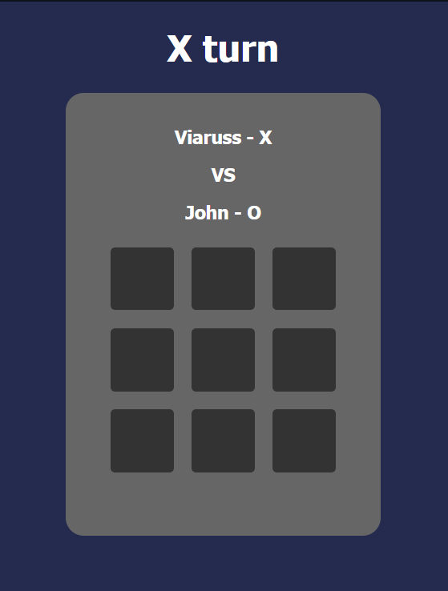

# TIC TAC TOE

## Table of Contents

* [General Info](#General-Info)
* [Key Features](#Key-Features)
* [To Do](#To-Do)
* [Technologies Used](#Technologies-Used)
* [Setup](#Setup)
* [How to Play](#How-To-Play)
* [Inspiration](#Inspiration)

# General Info

This project is a multiplayer tic-tac-toe game with a server-sided gameplay and a web GUI.

# Key Features

* Multilayered application
* Socket-Server Model and STOMP protocol
* Most of the gameplay logic is server-sided to prevent cheating
* Reactive GUI

# To Do

* Option to play vs computer at different levels of difficulty using the **MinMax** algorithm
* Better GUI Cosmetics 

# Technologies Used

* <b>Java 17
* Spring-Boot 3.2.3
* JQuery 3.6.0
* stomp.js 2.3.3
* sockjs-client 1.4.0
* Docker Images:
  * MongoDB 3.8
  * Mongo-Express 1.0.2 (Optional)</b>

## Setup

1. [x] Set up a MongoDb database using Docker Image or Regular server, then change **resources/application.properties** credentials if needed
2. [x] Start the **TicTacToeApplication** to run game server
3. [x] By default, the game will be running on http://localhost:8080

## How To Play

* First input Your name, If You are already in a game You will join it automatically

* If your name was not found in an existing game You will be able to choose whether you want to create a new game or join somebody else

* If You decide to join some other player a window for second player name input will appear
* After successfully connecting the board will appear and a game will start

* When the game is over, an option for playing again will appear

## Inspiration

As I rarely worked with html and css before, the GUI design was based on Marx's project at https://codepen.io/marxcom/pen/LWQXRX
